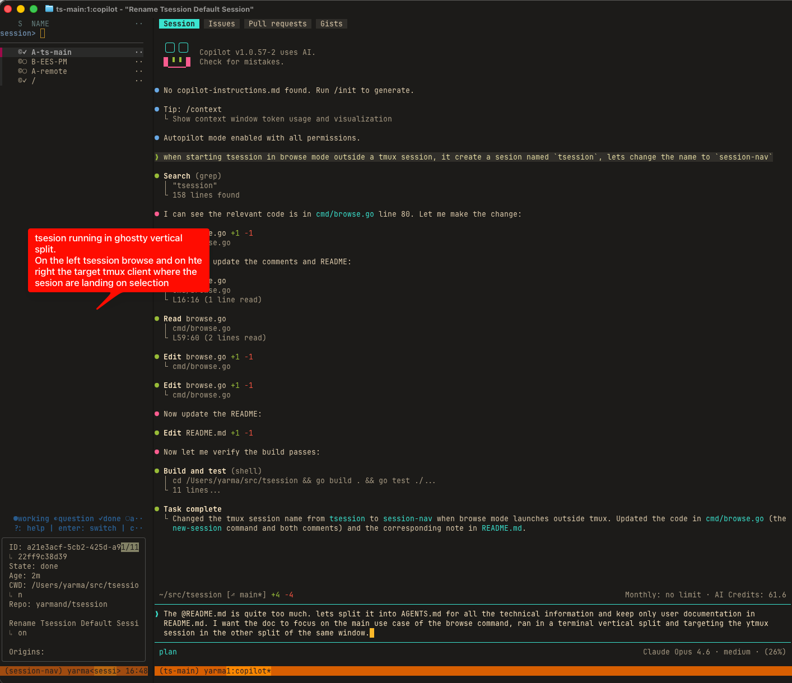
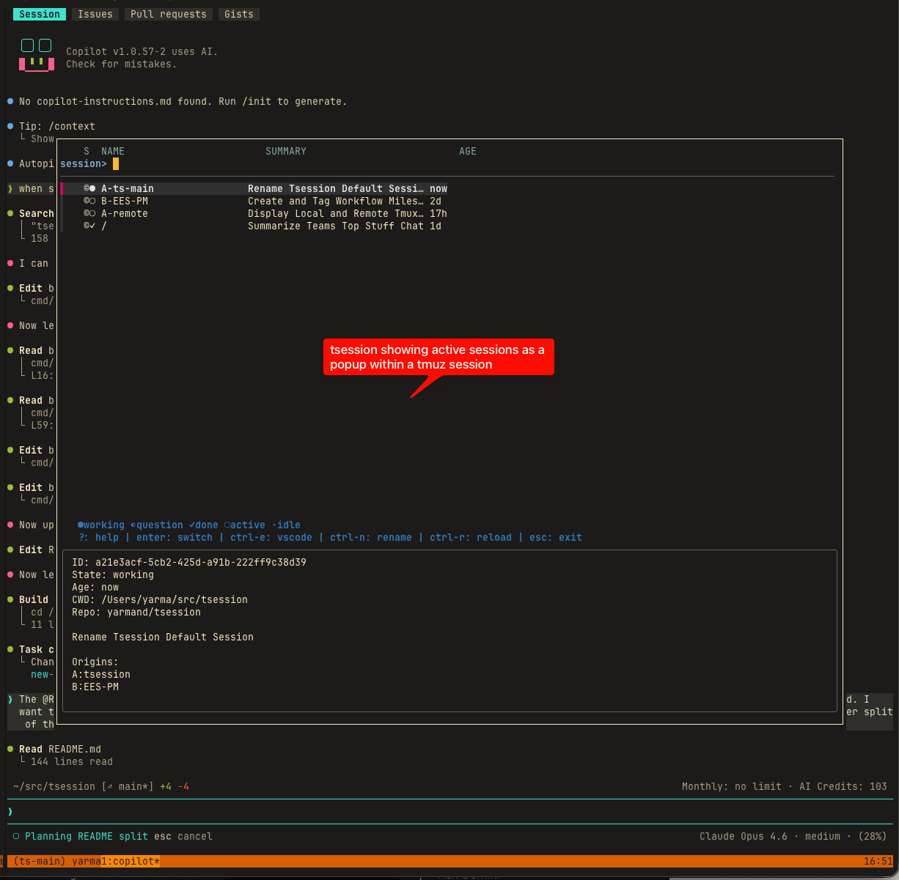

# tsession

A session navigator for [Copilot CLI](https://github.com/github/copilot-cli) and [pi](https://github.com/earendil-works/pi-mono) — browse, switch, and monitor your AI coding sessions from tmux.

## Install

Requires Go 1.25+, `tmux`, `fzf`, `lsof`.

```bash
make install    # builds and installs to ~/.local/bin/tsession
```

## Browse — session navigation in a terminal split

The primary workflow: use your terminal's native split to create two panes side by side. The left pane runs tsession as a persistent navigator; the right pane has a tmux client where your sessions live.



Before yo start tsession, use your native terminal split capabilities. the the split you want to display session, start a tmux session. This session is only here the tsession to easily discover the TTY.
In the split youwant the navigation, start tsession with:
```bash
tsession browse --watch --active --short --target pick
```

On first launch, tsession asks you to pick which tmux client to target (the right pane). Then it shows a live-updating fzf list of active sessions. Press `enter` to switch the target pane to that session.

The `--watch` flag keeps the picker open and refreshes every 5 seconds — it acts as a persistent session dashboard. Press `esc` to quit.

If started outside tmux, browse auto-creates a tmux session named `session-nav` and re-runs inside it.

## Popup — quick switcher from any tmux pane

For quick access without a dedicated split, bind tsession as a tmux popup:



Add to `~/.tmux.conf`:

```tmux
bind -n M-s display-popup -E -w 90% -h 70% "tsession popup --active --short"
```

Then `Alt-s` opens the picker as an overlay from any pane. Select a session and the popup closes, switching you there.

## Keybindings

| Key | Action |
|-----|--------|
| `enter` | Switch to the selected session |
| `ctrl-e` | Open session directory in VS Code |
| `ctrl-n` | Rename the session |
| `ctrl-r` | Reload the session list |
| `?` | Show help in the preview pane |
| `esc`/`q` | Exit the picker |

## Source indicators

| Prefix | Source |
|--------|--------|
| © | Copilot CLI |
| π | pi |

## State indicators

| Glyph | Meaning |
|-------|---------|
| ● | Agent is processing |
| ◐ | Agent finished with a question |
| ✓ | Agent finished (cleared on pane switch) |
| ○ | Waiting for user input |
| · | Idle or exited |

## Notifications

Pass `--notify` to `watch`, `list`, or `browse` to get a macOS notification the
moment an agent finishes (`done`, sound "Tink") or asks a question (`question`,
sound "Funk"). The most common setups are:

```bash
tsession watch --daemon --notify     # background daemon (recommended)
tsession browse --watch --notify     # while browsing
```

State is tracked in `~/.tsession/notify.json`; the first observation of each
session is recorded silently so you are not flooded on startup. Notifications
fire only while a long-running observer (`watch --daemon` or `browse --watch`)
is running. macOS only — a no-op on other platforms.

---
See [AGENTS.md](AGENTS.md) for technical internals, full flag reference, and cache architecture.


# Coming soon

- remote sessions support
  - ssh
  - github codespaces
  - devcontainers

| Glyph | State    | Meaning                                                                |
|-------|----------|------------------------------------------------------------------------|
| ●     | working  | last event was `tool.execution_start` (non-prompting tool) / `agent.processing` |
| ◐     | question | last event was `tool.execution_start` for `ask_user`/`ask_question`, or a permission request |
| ✓     | done     | session just transitioned from `working` to `active`; cleared the first time you switch to its tmux pane |
| ○     | active   | `session.db` held open by a live copilot process                       |
| ·     | idle     | no live process, no shutdown event                                     |
| ·     | exited   | `session.shutdown` event in `events.jsonl`                             |

## Creating Sessions

Create a fresh worktree and start a Copilot session in it:

```bash
tsession new my-feature                 # creates a worktree for branch my-feature
tsession new --path ~/src/repo.wt/foo   # use an existing worktree
tsession new my-feature -- --resume     # forward args after -- to copilot
```

`new` creates (or reuses) a git worktree, opens a tmux session named after the
worktree directory, and launches `copilot` inside it, then switches/attaches you
to that session.

### Configuring worktree creation

The commands used to create the worktree live in
`~/.config/tsession/new-worktree.sh`, auto-created with defaults on first run.
The script receives the branch name as `$1` and must print the resulting
worktree path as the **last line of stdout**. Edit it freely to match your
workflow. The default:

```sh
#!/usr/bin/env bash
set -euo pipefail
repo_root="$(cd "$(git rev-parse --git-common-dir)/.." && pwd)"
wt_folder="${repo_root}.worktrees"
mkdir -p "$wt_folder"
wt_path="$(realpath "$wt_folder")/$1"
git worktree add -b "$USER/$1" "$wt_path"
echo "$wt_path"
```

## Remote Sessions

Display Copilot CLI sessions running on remote machines alongside your local
sessions.

### Setup

Create `~/.config/tsession/config.yaml`:

```yaml
remotes:
  # Plain SSH remote
  - name: devbox
    host: devbox.local

  # SSH with custom path
  - name: server
    host: user@server.example.com
    copilot_dir: /home/user/.copilot

  # GitHub Codespace
  - name: my-codespace
    type: codespace
    codespace: urban-broccoli-abc123

  # Dev container (Docker)
  - name: my-container
    type: devcontainer
    container: myapp_devcontainer
    user: vscode

  # Custom SSH command (advanced)
  - name: custom
    ssh_command: my-ssh-wrapper
    host: target-host
```

#### Remote types

| Type | Fields | Connect command |
|------|--------|----------------|
| `ssh` (default) | `host`, optional `ssh_command` | `ssh <host> ...` |
| `codespace` | `codespace` (name) | `gh codespace ssh --codespace <name> ...` |
| `devcontainer` | `container`, `user` | `docker exec -u <user> <container> ...` |

#### All fields

| Field | Required | Default | Description |
|-------|----------|---------|-------------|
| `name` | yes | — | Label shown in the section header |
| `type` | no | `ssh` | Remote type: `ssh`, `codespace`, or `devcontainer` |
| `host` | type=ssh | — | SSH destination (user@host or ssh-config alias) |
| `ssh_command` | no | `ssh` | Custom SSH binary/command (type=ssh only) |
| `codespace` | type=codespace | — | Codespace name (from `gh codespace list`) |
| `container` | type=devcontainer | — | Docker container name |
| `user` | type=devcontainer | — | User inside the container (e.g. `vscode`) |
| `copilot_dir` | no | `~/.copilot` | Path to Copilot state on the remote |

**Requirements on the remote:**
- `bash` and `sqlite3` must be available in PATH
- `tmux` (optional — enables pane-level matching)
- SSH must be configured for passwordless access (key-based auth)

### How it works

`tsession` runs a lightweight gather script over SSH that collects session data
from the remote's `~/.copilot/` directory and tmux state. Data is returned as
JSON in a single SSH round-trip. Each remote appears as its own section:

```
── Local ──────────────────────────────────────────────────────────
  ● working  2m  tsession    Fix browse layout
  ○ active   1h  myproject   Add auth module
── devbox ─────────────────────────────────────────────────────────
  ● working  5m  backend     Implement caching
  · idle     3h  infra       Terraform refactor
```

### Resume behavior

Remote sessions are always wrapped in tmux on the remote for persistence — if
you disconnect, the agent keeps running and you can reattach later.

**When the session already has a tmux target** (detected by gather):
- Attaches directly: `ssh -t <host> tmux attach -t <target>`

**When no tmux target exists** (first connection or tmux wasn't detected):

| Type | Command |
|------|---------|
| `ssh` | `ssh -t <host> tmux new-session -As tsession-<id> 'copilot --resume=<id>'` |
| `codespace` | Tries tmux, falls back to direct resume if tmux unavailable |
| `devcontainer` | Tries tmux, falls back to direct resume if tmux unavailable |

### Flags

| Flag           | Description                                        |
|----------------|----------------------------------------------------|
| `--local-only` | Skip remote gathering (useful offline or for speed) |

### Caching

When `tsession watch` is running, remote data is gathered alongside local data
on each refresh cycle. Each remote has a 10-second timeout — unreachable hosts
are skipped with a warning without blocking the local cache update.

### Troubleshooting

- **Remote unreachable:** The section shows as
  `── devbox (unreachable) ──` and local sessions work normally.
- **sqlite3 not found:** The remote is skipped. Install `sqlite3` on the remote.
- **Slow SSH:** Ensure `ControlMaster` is configured in `~/.ssh/config` for
  persistent connections. The gather script completes in <1s on most hosts.

## Releases

Push a version tag (`vX.Y.Z`) to trigger `.github/workflows/release.yml`.
The workflow cross-compiles and publishes:

- `tsession_<tag>_linux_amd64.tar.gz`
- `tsession_<tag>_linux_arm64.tar.gz`
- `tsession_<tag>_darwin_arm64.tar.gz`

Each archive contains a single `tsession` binary. Assets are attached to the
GitHub release for that tag, so tools can fetch an exact tag's asset directly
or fall back to the latest release when resolving a binary for the current
platform.
