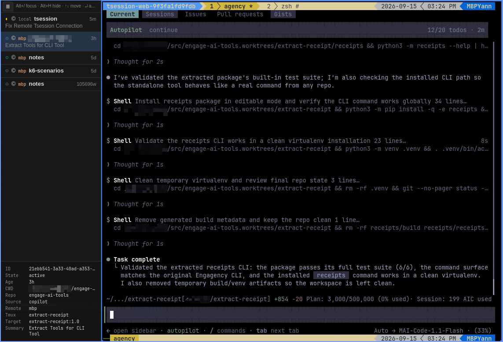
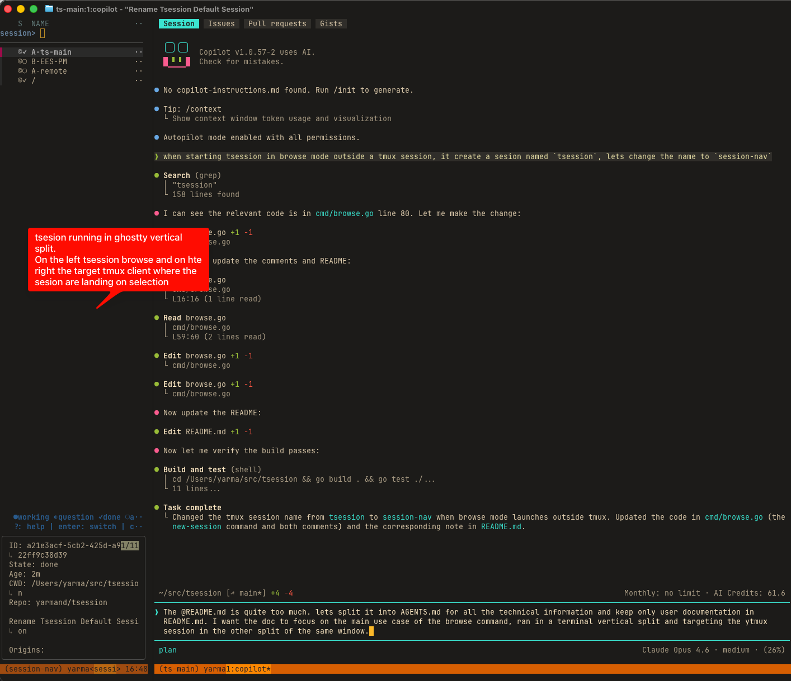
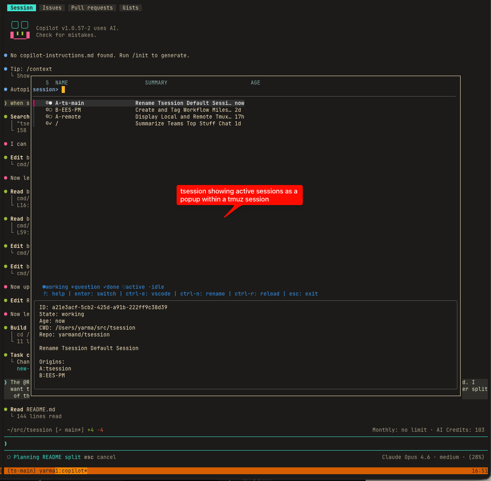

# tsession

**A local and remote session manager for agentic work—built on tmux and Git
worktrees, not a closed agent runtime.**

There are plenty of agent session managers. `tsession` takes a deliberately
open approach: keep using the terminal, agent tools, repositories, and remote
machines you already have. Run agents inside ordinary tmux sessions and Git
worktrees; `tsession` discovers them, shows their state in one place, and lets
you reconnect without forcing every session through a proprietary launcher.

Today, `tsession` has explicit integrations for
[Copilot CLI](https://github.com/github/copilot-cli) and
[pi](https://github.com/earendil-works/pi-mono). Its foundation—tmux for
long-lived processes and worktrees for isolated branches—keeps the workflow
independent of any single agent tool.

Remote work is first-class. Local sessions and sessions on SSH hosts appear in
the same dashboard, with support for exact remote tmux pane discovery and
browser-based attachment that avoids tmux-in-tmux. GitHub Codespaces and Docker
devcontainers are supported as additional transports.

## Why tsession?

- **Use the tools you want.** Start an agent yourself or use `tsession new` as
  a convenience; discovery does not depend on `tsession` owning the process.
- **Keep durable terminal sessions.** tmux remains the process and terminal
  substrate, so sessions survive disconnects and remain directly accessible.
- **Isolate work with Git worktrees.** Give each agent a branch and working
  directory without cloning the repository repeatedly.
- **See local and remote work together.** Monitor session state across your
  machine, SSH hosts, Codespaces, and devcontainers.
- **Choose your interface.** Use the native GUI, a browser/PWA, a persistent
  terminal navigator, a tmux popup, or plain JSON output.
- **Avoid lock-in.** The repositories, worktrees, tmux sessions, and agent
  state remain usable without the UI.

## Quick start

### 1. Install

Build and install the CLI and native GUI from source:

```bash
make install
```

The default installation directory is `~/.local/bin`:

- macOS: `tsession` and `TSession.app`
- Linux: `tsession` and `TSession`
- Windows: `tsession` and `TSession.exe`

Override it with:

```bash
make install PREFIX=/path/to/bin
```

Source builds require Go 1.25+, `tmux`, `fzf`, `lsof`, the Wails v2 CLI, and
the platform webview dependencies described in [gui/README.md](gui/README.md).
Use `make gui` to build the GUI without installing it.

### 2. Open the dashboard

Launch the native application:

```bash
tsession gui
```

Or run the same interface in a browser:

```bash
tsession serve --open
```



The dashboard combines local and remote sessions in one list. Each row shows
the agent source, state, repository/worktree, age, and local or remote origin.
Selecting a session opens its tmux terminal in the main pane.

Useful controls:

| Control | Action |
|---|---|
| `Alt+/` | Toggle focus between the session list and terminal |
| `Alt+H` | Collapse or restore the session list |
| `↑` / `↓` | Move through the focused session list |
| `Enter` | Open the highlighted session |
| `F2` | Rename the selected session |
| Top-left button | Collapse or restore the session list |
| Drag the list edge | Resize the session list; the width is remembered |

When the list is collapsed, `Alt+/` opens it as an overlay without resizing
the terminal. Selecting a session closes the overlay automatically. Remote
origins receive distinct colors so sessions from different hosts remain easy
to identify.

### 3. Add an SSH host

Create `~/.config/tsession/config.yaml`:

```yaml
remotes:
  - name: devbox
    host: devbox.example.com
```

Restart or refresh the dashboard. Active sessions from `devbox` will appear
beside local sessions.

Remote commands initialize the user's configured shell as an interactive login
shell, matching a normal SSH terminal and loading PATH additions such as
Homebrew. If `tsession` is already available in that PATH, it is used directly
without an installation or version check. Otherwise, a matching release is
installed under `~/.tsession/remote-bin/`.

## How it works

`tsession` merges agent state, tmux topology, repository/worktree identity, and
configured remote origins into a unified session list.

1. **Agents run normally.** Start Copilot CLI or pi in a tmux pane using your
   existing commands and configuration.
2. **Worktrees provide isolation.** A Git worktree gives each task its own
   branch and working directory. This is recommended, not mandatory.
3. **Agent state is discovered.** `tsession` reads the supported agent's local
   state and determines whether it is working, waiting for input, done, idle,
   or exited.
4. **Processes are matched to tmux.** The owning agent PID is traced to its
   tmux pane. A working-directory match is used as a fallback.
5. **Remotes use the same model.** On an SSH host, the remote `tsession`
   watcher and active list provide the same tmux-aware session metadata as a
   local invocation.
6. **Any front end can attach.** The GUI/browser embeds a terminal; the
   terminal navigator switches a selected tmux client; plain `list` output is
   available for scripts.

`tsession new` can create the worktree and tmux session for you, but it is not
required. Sessions started independently are still discoverable when they use
a supported agent and run in tmux.

### Supported agent integrations

**Copilot CLI** sessions are discovered from the Copilot session store and
per-session state directories automatically.

**pi** sessions require the bundled state extension:

```bash
cp extension/pi/tsession-state.ts ~/.pi/agent/extensions/
```

Reload or restart pi after installing it. The extension records lifecycle state
under `~/.tsession/pi-state/`; the agent itself still runs normally in tmux.

## Interfaces

### Native GUI

```bash
tsession gui
```

The native Wails application embeds the same loopback web server and UI as
`tsession serve`. It runs in a native OS window with no browser process to
manage. The installed application is discovered beside the `tsession` CLI.

See [gui/README.md](gui/README.md) for platform prerequisites and development
commands.

### Browser UI and PWA

```bash
tsession serve
tsession serve --open
```

The server binds to `127.0.0.1:4270` by default and rejects non-loopback
addresses. The UI can also be installed as a PWA from Chrome, Edge, or Safari.

Local sessions attach through a grouped tmux session, giving the browser its
own terminal size without resizing or stealing another attached client.
Remote sessions execute the same grouped attach through SSH, Codespaces, or
Docker.

This is particularly useful for remote work: the browser owns the outer PTY,
so attaching to a remote tmux session does not create a local-tmux →
SSH → remote-tmux stack with doubled status bars and conflicting prefix keys.

PTYs stay warm when a browser tab disconnects. Their grouped tmux sessions are
torn down only when explicitly closed or when the server shuts down.

### Advanced: persistent terminal navigator

For users who prefer a terminal-only workflow, create a native terminal split:
one side runs the navigator and the other contains the tmux client to switch.



```bash
tsession browse --watch --active --short --target pick
```

On first launch, choose the tmux client that should display selected sessions.
The navigator excludes its own `session-nav` client. `--watch` refreshes the
picker every five seconds.

If started outside tmux, `browse` creates a `session-nav` tmux session and
re-runs itself inside it.

Terminal picker keys:

| Key | Action |
|---|---|
| `Enter` | Switch to the selected session |
| `Ctrl+E` | Open the session directory in VS Code |
| `Ctrl+N` | Rename the session |
| `Ctrl+A` | Rename the repository |
| `Ctrl+R` | Reload the list |
| `?` | Show help in the preview pane |
| `Esc` / `Q` | Exit |

### Advanced: tmux popup



Add a shortcut to `~/.tmux.conf`:

```tmux
bind -n M-s display-popup -E -w 90% -h 70% "tsession popup --active --short"
```

`Alt+S` opens the picker over the current pane. Selecting a session closes the
popup and switches to it.

### Scripts and integrations

```bash
tsession list
tsession list --active
tsession list --active --json
```

`--json` emits the discovered session records as machine-readable JSON.
`--fzf` emits the tab-delimited format used by the terminal navigator.

## Creating sessions and worktrees

Create a worktree and start Copilot CLI inside a matching tmux session:

```bash
tsession new my-feature
tsession new --path ~/src/repo.worktrees/existing
tsession new my-feature -- --resume
```

Anything after `--` is forwarded to Copilot CLI.

The worktree creation command is configurable in
`~/.config/tsession/new-worktree.sh`. The script receives the requested branch
name as `$1` and must print the final worktree path as the last line of stdout.
It is created with this default:

```bash
#!/usr/bin/env bash
set -euo pipefail
repo_root="$(cd "$(git rev-parse --git-common-dir)/.." && pwd)"
wt_folder="${repo_root}.worktrees"
mkdir -p "$wt_folder"
wt_path="$(realpath "$wt_folder")/$1"
git worktree add -b "$USER/$1" "$wt_path"
echo "$wt_path"
```

Edit the script freely to match your branch naming and worktree layout.

## Remote session management

SSH is the primary remote transport. GitHub Codespaces and Docker
devcontainers use the same discovery and attachment model.

### Configuration

```yaml
remotes:
  # SSH host or ssh-config alias
  - name: devbox
    host: devbox.example.com

  # SSH with a custom command
  - name: lab
    host: user@lab.example.com
    ssh_command: ssh -J bastion

  # GitHub Codespace
  - name: codespace
    type: codespace
    codespace: urban-broccoli-abc123

  # Docker devcontainer
  - name: container
    type: devcontainer
    container: myapp_devcontainer
    user: vscode

  # Keep a remote configured but temporarily disabled
  - name: offline
    host: offline.example.com
    active: false
```

| Field | Required | Default | Description |
|---|---|---|---|
| `name` | Yes | — | Label and color identity shown in the UI |
| `active` | No | `true` | Whether the remote participates in discovery |
| `type` | No | `ssh` | `ssh`, `codespace`, or `devcontainer` |
| `host` | SSH | — | SSH destination or ssh-config alias |
| `ssh_command` | No | `ssh` | Custom SSH command, options, or wrapper |
| `codespace` | Codespace | — | Codespace name |
| `container` | Devcontainer | — | Docker container name |
| `user` | No | — | User passed to `docker exec` |
### Remote discovery

For each enabled remote, `tsession`:

1. Connects through the configured transport.
2. Initializes the configured user shell as an interactive login shell so
   Homebrew and other PATH setup is available.
3. Uses `tsession` from PATH when present; otherwise installs a matching
   release under `~/.tsession/remote-bin/<version>/tsession`.
4. Ensures `tsession watch --daemon` is running.
5. Reads `tsession list --active --local-only --json`.
6. Preserves the remote tmux session and exact pane target in the local
   dashboard.

The same remote metadata is available in the GUI/browser information panel and
the terminal picker's preview.

### Remote attachment

- **GUI/browser:** runs a grouped tmux attach over the configured transport.
  The browser terminal avoids nesting a local tmux client around the remote
  tmux client.
- **Terminal navigator:** creates or reuses a local bridge tmux session named
  `tsession-r-<remote>-<id-hash>` and runs the remote attach inside it.
- **Missing exact target:** if tmux is available but no usable target is
  discovered, `tsession` can create a deterministic fallback tmux session and
  resume Copilot CLI.
- **No remote tmux:** the fallback runs Copilot CLI resume directly.

Remote requests time out independently, so an unreachable host does not block
local sessions or other remotes.

### SSH troubleshooting

- Ensure passwordless SSH works from the same account running `tsession`.
- If Homebrew provides `tmux` or `tsession`, confirm it appears in an
  interactive login shell:

  ```bash
  ssh -t devbox '$SHELL -lic "command -v tmux; command -v tsession"'
  ```
- Configure SSH `ControlMaster`/`ControlPersist` to reduce repeated connection
  latency.
- Run `tsession list --active` directly on the remote to inspect its local
  agent-to-tmux matching.

## Session state and identity

### Agent sources

| Prefix | Source |
|---|---|
| © | Copilot CLI |
| π | pi |

### States

| Glyph | State | Meaning |
|---|---|---|
| ● | `working` | The agent is processing or executing tools |
| ◐ | `question` | The agent is waiting for user input or permission |
| ✓ | `done` | The agent has just finished; cleared when the pane is selected |
| ○ | `active` | A live session is waiting for input |
| · | `idle` | No live process is currently attached |
| · | `exited` | The session emitted a shutdown event |

### Names and repository aliases

Use `Ctrl+N` in the terminal picker, `F2` in the GUI, or:

```bash
tsession rename <session-id> [name]
```

Session names are stored in `~/.tsession/names.json`. When a matching local
tmux session exists, it is renamed too.

Use `Ctrl+A` in the terminal picker, the repository context action in the GUI,
or:

```bash
tsession rename-repo <session-id> [alias]
```

Repository aliases are stored in `~/.tsession/repo-names.json` and are shared
across worktrees for the same repository.

## Cache and notifications

Start the background cache watcher for faster repeated list rendering:

```bash
tsession watch --daemon
tsession watch --daemon --interval=5s
tsession stop-watch
```

The watcher writes `~/.tsession/cache.json`. Fresh cache reads complete without
re-querying every local and remote source; stale or missing caches fall back to
live discovery. Use `tsession list --no-cache` to force a live read.

On macOS, `--notify` fires a desktop notification when a session enters
`done` or `question`:

```bash
tsession watch --daemon --notify
tsession browse --watch --notify
```

The first observation is recorded silently to avoid a notification flood.
Desktop notification state is stored in `~/.tsession/notify.json`; browser
notifications maintain an independent snapshot.

## Command reference

```text
tsession list [flags]
tsession new <branch> [-- copilot-args]
tsession new [-p|--path <dir>] [-- copilot-args]
tsession browse [flags] [query]
tsession popup [flags]
tsession resume [--target=...] <session-id>
tsession rename <session-id> [name]
tsession rename-repo <session-id> [alias]
tsession vscode <session-id>
tsession watch [--daemon]
tsession stop-watch
tsession serve [--addr] [--open]
tsession gui
```

Common list/browse/popup flags:

| Flag | Description |
|---|---|
| `--max-age <duration>` | Ignore sessions older than the duration; default `336h` |
| `--active` | Show sessions with meaningful live state and tmux availability |
| `--short` | Compact state/repository/summary/age rendering |
| `--lshort <n>` | Compact rendering truncated to `n` characters |
| `--local-only` | Skip configured remotes |
| `--no-cache` | Force live discovery (`list` only) |
| `--no-color` | Disable ANSI colors (`list` only) |
| `--json` | Emit JSON (`list` only) |
| `--fzf` | Emit tab-delimited picker data (`list` only) |
| `--watch` | Refresh the terminal browser every five seconds (`browse` only) |
| `--target <value>` | Select the tmux client to switch (`browse`/`resume`) |
| `--notify` | Process macOS done/question notifications |

For implementation details, data sources, state transitions, and package
architecture, see [AGENTS.md](AGENTS.md).

## Maintainer: publishing releases

Push a version tag (`vX.Y.Z`) to trigger `.github/workflows/release.yml`.
The workflow cross-compiles and publishes:

- `tsession_<tag>_linux_amd64.tar.gz`
- `tsession_<tag>_linux_arm64.tar.gz`
- `tsession_<tag>_darwin_arm64.tar.gz`

Each archive contains a single `tsession` binary. Assets are attached to the
GitHub release so remote installation can resolve an exact tag or fall back to
the latest compatible release.
